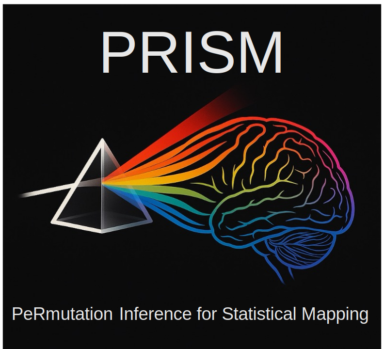

<p align="left">
    
</p>

# Prism

**Fast, modular, and extensible permutation-based statistical inference for neuroimaging.**

Prism is a Python library for running fast, scalable, and fully nonparametric statistical analyses on brain imaging data. It replicates much of the core functionality of Anderson Winkler's [PALM](https://fsl.fmrib.ox.ac.uk/fsl/fslwiki/PALM), but without MATLAB dependencies.

---

## 📚 Documentation

- [Dataset API](docs/dataset.md)
- [Permutation Analysis](docs/permutation_analysis.md)
- [Spatial Similarity](docs/spatial_similarity.md)
- [Statistical Functions](docs/statistical_functions.md)
- [Usage Examples](docs/usage_examples.md)

For background and motivation, see the [project manuscript](manuscript/manuscript.md).

---

## 🚀 Features

- **Mass univariate GLM analysis** with flexible contrast modeling
- **Permutation-based testing** including sign flips and blockwise shuffling
- **Support for TFCE**, FDR, FWE (Westfall–Young), and GPD-based p-value tail estimation
- **Voxelwise map comparison tools** for assessing spatial similarity
- **CLI interface** modeled after PALM
- Works directly with **NIfTI files** or **NumPy arrays**

---

## 🛠️ Installation

```bash
git clone https://github.com/josephisaacturner/prism.git
cd prism
pip install -e .
```

If you're on MacOS with Apple silicon, you may need to manually install a jax dependency:

```bash
pip install jax-metal
```

---

## Minimal Example

```python
import numpy as np
from prism.datasets import Dataset

Y = np.random.randn(100, 50)        # Brain data (samples x voxels)
X = np.random.randn(100, 2)         # Design matrix
C = np.array([1, -1])               # Contrast

dataset = Dataset(
    data=Y,
    design=X,
    contrast=C,
    output_prefix="prism_example",
    n_permutations=1000
)

results = dataset.permutation_analysis()
```

More full examples are available in [Usage Examples](docs/usage_examples.md).

---

## Contributing

We welcome contributions! To get started:

1. Fork this repository
2. Create a new branch: `git checkout -b feature-name`
3. Make your changes
4. Commit: `git commit -m "Description"`
5. Push and open a pull request!

---

## 📂 Project Structure

```
prism/
├── prism/                            # Core Python package
│   ├── data/                         # Brain templates or masks
│   ├── datasets/                     # Dataset class logic
│   ├── stats/                        # GLM and stat functions
│   ├── permutation_inference.py      # Main permutation logic
│   ├── preprocessing.py              # Data loading, masking, preprocessing
│   ├── tfce.py                       # TFCE implementation
│   ├── spatial_similarity.py         # Spatial map correlation engine
│   ├── prism_cli.py                  # Command-line interface (pypalm)
├── docs/                             # Markdown documentation
├── notebooks/                        # Example Jupyter notebooks
├── tests/                            # Unit tests
├── assets/                           # Static images and logos
├── manuscript/                       # Project manuscript
├── README.md                         # You are here
├── requirements.txt                  # Dependencies
├── pyproject.toml                    # Build system metadata
└── LICENSE
```

---

## License

Prism is released under the [MIT License](LICENSE).